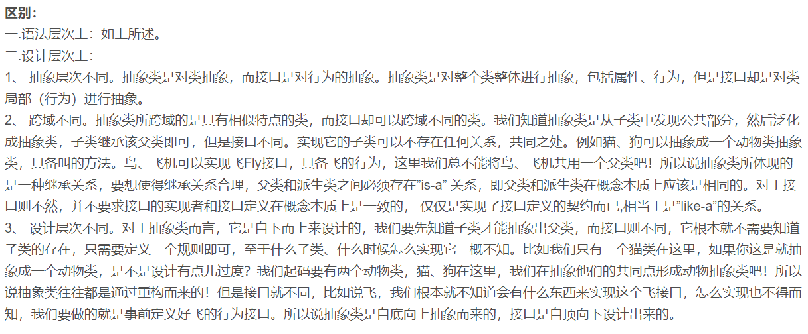

## 接口
接口就是给出一些没有实现的方法，封装到一起，再根据具体情况把这些方法写出来

语法：
```java
interface 接口名 {
    // 属性
    // 方法 (1. 抽象方法 2. 默认实现方法 3. 静态方法)
}
```
```java
class 类名 implements 接口 {
    自己属性; 
    自己方法;
    // 对接口的属性或方法进行重写
    //必须实现的接口的抽象方法
```
### <font color = yellow>小节</font>
1. 在 jdk7.0 之前，接口里的所有方法都没有方法体，即都是抽象方法
2. Jdk8.0 后接口类可以有静态方法，默认方法，也就是说接口中可以有具体的方法实现

### 注意事项和细节
1. 接口不能被实例化
2. 接口中所有的方法都是 public 方法(public 省略)，接口中的抽象方法，可以不用abstract修饰，也就是说 public abstract 省略
```java
void aaa();
// 实际上是abstract void aaa();
```
3. 一个普通类实现接口，就必须将接口的所有方法都实现
4. 抽象类实现接口，可以不用实现接口的方法（也就是说一个普通类如果没有实现所有的抽象方法，那么这个普通类就必须用 abstract 修饰，变成抽象类，由它的子类来实现相关方法)
5. 一个类可以同时实现多个接口
6. <font color = yellow>接口中的属性只能是 final 的，而且是 ```public static final ```修饰符。比如：```int a = 1```，实际上是```public static final int a = 1```;必须初始化</font>
7. 接口中属性的访问形式：接口名.属性名
8. 一个接口不能继承其他的类，但可以继承多个别的接口
9. 接口的修饰符只能是public和默认，这点和类的修饰符是一样的
    
## 接口 VS 继承类
* 接口和继承解决的问题不同
  * 继承的价值主要在于：解决代码的<font color = yellow>复用性和可维护性</font>
  * 接口的主要价值在于：设计，设计好各种规范（方法），让其它类去实现这些方法。
* 接口比继承更加灵活
  * 接口比继承更加灵活，继承满足 is-a 的关系，而接口只需满足 like-a 的关系
* 接口在一定程度上实现代码的解耦[即：接口规范性+动态绑定机制]



### 接口的多态特性
1. 多态参数
2. 多态数组
3. 接口存在<font size = 5 color = yellow>多态传递</font>
